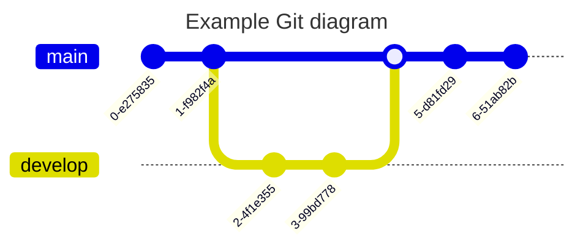

# Mermaid

Mermaid is a simple markdown-like script language for generating charts from text via javascript.

## Installation

```bash
npm install -g mermaid.cli
```

## Usage

```bash
mmdc -i input.mmd -o output.png
```

## Types of charts

- Flowchart


- Sequence diagram


- Gantt diagram


- Class diagram


- State diagram


- Pie chart


- User Journey


- Entity Relationship Diagram


- Git graph

