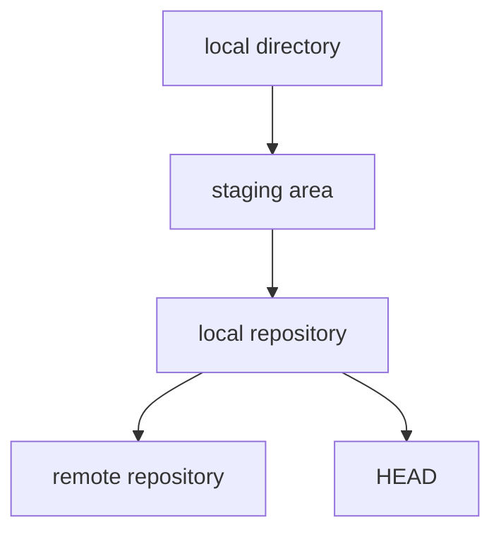

# Git CLI

## Terminology

1. **local directory**: the saved files currently on your computer
2. **staging area**: set of files that have been added but not committed; same as the index
3. **index**: set of files that have been added but not committed; same as the staging area
4. **local repository**: set of files that have been committed even if they are not yet pushed remotely
5. **remote repository**: the files that exist on the remote git server
6. **HEAD**: the commit that is currently checked out (usually the most recent commit on the current branch)
7. **detached HEAD**: when your current repo is pointed to a commit that is not the most recent commit on a branch



## Configuration

**Set user name and email**

```bash
git config --global user.name "Joel Breit"
git config --global user.email "Joel@Breitest.com"
```

## Commands

**help**

**init** - Initialize a new Git repo
- `git init

Uninitialize a Git repo
- `rm -rf .git`

**branch** - Edit or view branches
- `git branch [flags] [branch_name]`
- `git branch` - Display the current branch
- Flags:
  - `-a`: List all branches `git branch -a`
  - `-d`: Delete a branch `git branch -d old_branch`
  - `-m`: Rename a branch
    - Current branch: `git branch -m new_branch`
    - Different branch: `git branch -m old_branch new_branch`
  - `-r`: List remote branches `git branch -r`
  - `-u`: Set upstream branch `git branch -u origin/master`

**clean** - Remove untracked files
- `git clean [flags]`
- Flags:
  - `-d`: Remove untracked directories
  - `-f`: Force the clean
  - `-i`: Interactive mode
  - `-n`: Dry run (show what would be removed)

**log** - View commit history
- `git log [flags]`
- `git log --oneline --graph` - Show a graph of the commit history
- Flags:
  - `--oneline`: Show each commit on one line
  - `--graph`: Show a graph of the commit history

**tag** - Create, list, or delete tags
- `git tag [flags] [tag_name] [commit]`
- `git tag` - List tags
- `git tag -a [tag_name] -m [message]` - Create an annotated tag
- `git tag -d [tag_name]` - Delete a tag
- `git push origin --delete [tag_name]` - Delete a tag from remote
- `git tag -f [tag_name] [commit]` - Move a tag to a different commit
- `git push --tags` - Push all tags to remote
  - Git does not push tags by default
- `git checkout [tag_name]` - Checkout a tag
- Flags:
  - `-a`: Create an annotated tag 
  - `-m`: Message for (an annotated) tag
  - `-d`: Delete a tag
  - `-v`: Verify a tag
  - `-f`: Move a tag to a different commit

**diff** - Show changes between commits, branches, etc.
- `git diff [flags] [commit1] [commit2]`
- `git diff` - diff between working directory and staging area
- `git diff --cached` - diff between stage and last commit
- `git diff HEAD` - diff between working directory and current HEAD
- `git diff [commit1] [commit2]` - diff between two commits
- Flags:
  - `--cached`: diff between stage and last commit
  - `--name-only`: Show only the names of changed files
  - `--name-status`: Show only the names and status of changed files
  - `--stat`: Show statistics about changes

**move** - Move or rename a file so that Git tracks the move
- `git mv [old_file] [new_file]`

**clone** - Clone a remote repository
- `git clone [repo_url] [directory]`
- `git clone [repo_url]` - Clone into a directory with the same name as the repo
- Clone from one local repo to another
  - `git clone /path/to/repo /path/to/destination`

## Esoteric Commands I Like

Display the name, commit hash, and date of every tag in the repo:

`git for-each-ref --format '%(refname:short) %(objectname) %(creatordate)' refs/tags`

Display the name, commit hash, and date of every tag in the repo, sorted by date:

`git log --graph --oneline --all`

Show all authors of the repo sorted by number of commits:

`git log --format='%an <%ae>' | sort | uniq -c | sort -nr`

## TODO

- [ ] reset
- [ ] rev-parse
- [x] git command for moving a file and tracking that move in the history
- [ ] "Rebase onto" vs "Merge into" vs "Fast-forward to"