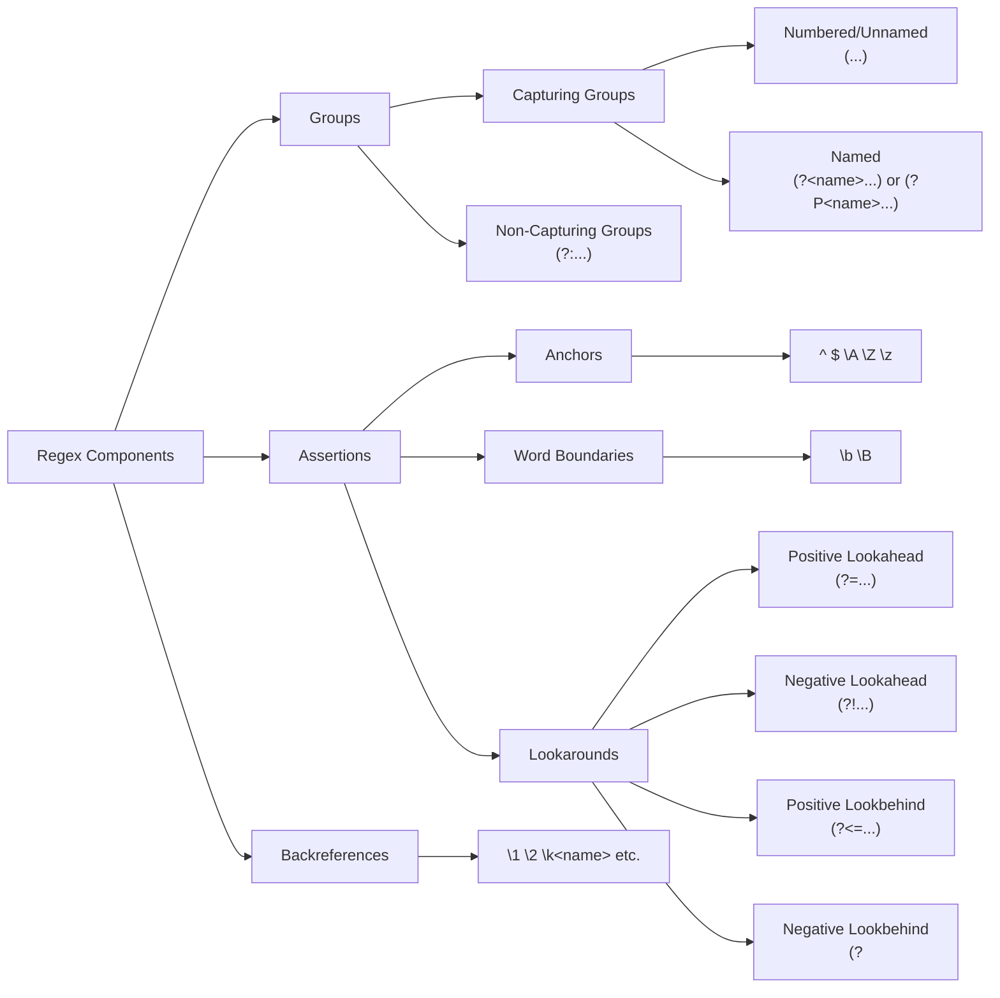

# Natural Language Processing Concepts Notes

## Linguistics

1. **morpheme**: the smallest meaning-bearing unit of text (e.g. "un-", "break", "-able" for "unbreakable")
2. **morphology**: branch of linguistics studying the way words are built up from smaller meaning-bearing units
3. **stem**: the root morphemes of words
4. **affixes**: morphemes that add additional meaning to a word
5. **clitic**: a word that cannot stand alone and is treated as part of another word (e.g. 'm, 's, and n't, in I'm, he's, and can't)
6. **word**: the smallst independent unit of text
7. **sentence**: a group of words that expresses a complete thought
8. **utterance**: the spoken equivalent of a sentence
9. **lemma**: a set of words that have the same root form (e.g. "run", "ran", "running")
10. **wordform**: a specific word in a lemma (e.g. "running")
11. **coreference**: the task of deciding whether two strings refer to the same entity
12. **the distributional hypothesis**: idea that words that occur in similar contexts tend to have similar meanings
13. **word sense**: a particular meaning of a word in a specific context
14. **polysemous**: words with multiple word senses like "bank" or "bat"
15. **principle of contrast**: idea that no two words have exactly the same meaning
16. **lexical semantics**: the linguistic study of word meaning
17. **semantic field**: a set of words related by topic (or semantic domain)
18. **hypernymy**: the relationship between words where one word is more general than another ("is a" relationship)
19. **meronymy**: the relationship between words where one word is a part of another (part-whole relationship)
20. **semantic frame**: a set of words that denote aspects of a particular type of event like a commercial transaction
21. **connotation**: the affective (emotional or cultural) association of a word
22. **valence dimension**: the positive or negative emotional charge of a word
23. **arousal dimension**: the intensity of the emotional charge of a word
24. **dominance dimension**: the degree of control or power associated with a word

## Text Processing

### Classical Text Processing

25. **corpus**: the entirety of a collection of text
26. **text normalization**: converting text into a consistent form that can be used for further processing
27. ~~**word normalization**: the task of reducing words/tokens to a standard format~~
28. **case folding**: converting all text to lowercase
29. **stemming**: removing prefixes and suffixes of words for simplification
30. **lemmatization**: the task of determining that two words have the same root (the words am, are, and is have the shared lemma be)
31. **sentence segmentation**: breaking up a text into individual sentences, using cues like periods or exclamation points
32. **edit distance**: a measurement of the number of operations needed to transform one string into another
33. **byte-pair encoding / BPE algorithm**: a method for tokenizing text by iteratively merging the most frequent pairs of tokens into a single token (starting with characters) until a desired vocabulary size is reached
34. **stop words**: common words that are often removed from text before processing

### Tokenization

35. **token**: a unit of text that can be a word or a part of a word
36. **tokenization**: the task of breaking up text into a predefined vocabulary
37. **byte-pair encoding / BPE algorithm**: a method for tokenizing text by iteratively merging the most frequent pairs of tokens into a single token (starting with characters) until a desired vocabulary size is reached

### Vector Semantics

38. **vector semantics**: NLP method of representing word meanings as vectors of numbers in a high-dimensional space
39. **embeddings**: representations of discrete data, like words, as continuous vectors that capture semantic meaning
40. **static embeddings**: word embeddings represented by a single fixed vector, regardless of the context in which the word appears
41. **contexual embeddings**: advanced embeddings that generate different vectors for a word depending on its context
42. **sparse vector**: a vector with mostly zero values
43. **dense vector**: a vector with many non-zero values
44. **similarity metric**: a measure of how alike two vectors are
45. **vector magnitude**: the length of a vector, calculated as the square root of the sum of the squares of its values
46. **dot product/inner product**: the sum of the products of the corresponding elements of two vectors
47. **parallel/collinear vectors**: vectors that point in the same direction or lie on the same line
48. **cosine metric**: a vector similarity metric that ignores vector magnitude that measures the angle between them (1 when they point in the same direction (colinear), -1 when they point in opposite directions (negatively parallel), 0 when they are orthogonal)
49. **formula for cosine of vectors**: (v1 • v2) / (|v1| * |v2|)
50. **tf-idf (term frequency - inverse document frequency) weighting**: a simple method for weighting the importance of words in a document based on their frequency in the document and their rarity in the corpus
51. **formula for idf of a term**: log(10) (number of documents in the collection / number of documents containing the term)
52. **formula for tf**: log(10) (number of times the term appears in the document + 1)
53. **formula for tf-idf**: tf * idf ()
54. **pointwise mutual information**: a measure of how much more likely two words are to co-occur than if they were independent
55. **centroid**: the multidimensional version of the mean - the single vector that has the minimum sum of squared distances to each vector in a set
56. **backoff**: technique used in language modeling to estimate the probability of unseen n-grams by using lower-order n-grams
57. **Named Entity Recognition (NER)**: the task of finding and labeling things like persons, organizations, locations, quantities, etc in text

## Regular Expressions

### Basics

58. **regular expressions**: a language for specifying text search strings
59. **regex anchors**: regex symbols used to specify positions in a string, e.g. `^`, `$`, `\b`, and `\B` (beginning of line, end of line, word boundary, non-word boundary)
60. **regex disjunction**: regex operator for specifying alternatives, using `|` to separate them
61. **greedy matching**: regex matching that tries to match as much as possible
62. **lazy matching**: regex matching that tries to match as little as possible (like the `*?` and `+?` operators)
63. **Kleene star ("cleany star")**: the `*` quantifier in regex for matching zero or more occurrences of a pattern
64. **Kleene plus ("cleany plus")**: the `+` quantifier in regex for matching one or more occurrences of a pattern

### Registers and Groups

65. **regex groups**: a way to treat part of a regular expression as a single unit created by enclosing a subpattern in parentheses
66. **regex substitution**: replacing matched regex patterns with other patterns
67. **capture group**: a part of a regex pattern that is enclosed in parentheses and can be referred to later (...)
68. **regex register**: a numbered list of capture groups in a regex pattern
69. **non-capturing group**: a group in a regex pattern explicitly excluded from the register `(?:pattern)`
70. **regex assertion**: a regex operator for matching a pattern without consuming any characters
71. **lookahead assertion**: a regex operator for matching a pattern only if it is followed by another pattern e.g. `(?=pattern)`
72. **negative lookahead assertion**: a regex operator for matching a pattern only if it is not followed by another pattern e.g. `(?!pattern)`

### Advanced

73. **regex flag/modifier**: regex syntax used outside of the expression that modifies how it is interpreted (e.g. case sensitivity or multiline matching)
74. **regex escape sequences**: special symbols that match specific characters (e.g. `\d` for any digit)
75. **regex quantifier**: regex syntax that specifies how many instances of a character, group, or character class are expected in the input for a match to be found
76. **regex character class**: a regex definition of a set (or range) of characters enclosed in square brackets [...] that matches 1 character from the set
77. **regex backreferences**: regex symbols used to recall prior cature groups in the pattern (e.g. `\1` for the first group and `\k<name>` for a named group)
78. **regex lookbehind assertions**: a way to match a pattern only if it is preceded by another pattern (e.g. `(?<=pattern)`)
79. **regex negative lookbehind assertions**: a way to match a pattern only if it is not preceded by another pattern (e.g. `(?<!pattern)`)
80. **regex named groups**: a way to assign an identifier to a regex capture group (e.g. `(?<name>pattern)`)
81. **regex named backreferences**: regex symbols used to recall prior named groups in the pattern (e.g. `\k<name>`)
82. **regex word boundary**: a regex assertion for matching the position between a word character and a non-word character (`\b`)

