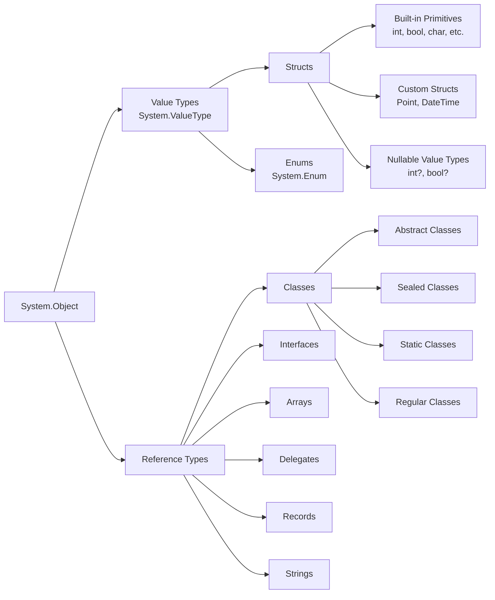

# C# Notes

## Table of Contents

- [C# Notes](#c-notes)
	- [Table of Contents](#table-of-contents)
	- [Vocabulary](#vocabulary)
		- [Terminology](#terminology)
			- [Class Parts](#class-parts)
			- [Object Types](#object-types)
	- [Concepts](#concepts)
	- [Notes](#notes)
		- [Libraries](#libraries)
	- [Syntax](#syntax)
		- [Static](#static)
	- [Data Types](#data-types)
	- [Modifiers](#modifiers)
	- [Control Flow](#control-flow)
	- [Data Structures](#data-structures)
		- [Arrays](#arrays)
		- [Lists](#lists)
		- [Enum](#enum)
	- [Methods](#methods)
		- [Parameter Passing](#parameter-passing)
	- [Object Orientation](#object-orientation)
		- [Inheritance](#inheritance)
	- [Common Tasks](#common-tasks)
	- [Naming Conventions](#naming-conventions)
	- [Thoughts](#thoughts)
		- [Positives](#positives)
		- [Negatives](#negatives)
	- [Questions](#questions)


## Vocabulary

- **IL (Intermediate Language) Code**: The code that is generated by the C# compiler
- **JIT (Just-In-Time) Compilation**: Conversion of IL code into machine code at runtime
- **Assembly Files**: A copy of compiled code in .NET applications
- **Library Files**: Assemblies that can not be run directly but provide functionality to other assemblies
- **Executable**: Assemblies that can be run directly, use an `.exe` extension, and can utilize libraries
- **Common Language Runtime (CLR)**: Environment that converts IL code into machine code for a specific platform
- **Namespace**: A way to organize and group related classes, interfaces, and other types in C#
- **List**: Resizeable collection of elements that maintains order. Part of the `System` namespace and the go-to data structure in C#.

### Terminology

#### Class Parts

- **member** refers to any property, method, or event that belongs to a class or struct
- **field** - a variable that is declared directly in a class or struct
- **property** - a field in a C# class that provides accessors
- **method** - any class function (static or instance)

#### Object Types

- **reference type** - *a type that is accessed by reference, meaning that a variable of this type holds a reference to the memory location where the actual data is stored (e.g., classes, arrays, delegates, and strings)*
- **value type** - *a type that is accessed by value, meaning that a variable of this type holds the actual data (e.g., primitive types like int, float, bool, and structs)*
- **primitive type** - *a built-in data type that represents a single value (e.g., int, float, bool, char)*



## Concepts

- An application can have multiple assemblies. An assembly can have multiple namespaces. A namespace can have multiple classes.
- C# primitive types map to .NET types.
  - `int` -> `System.Int32`
- Properties vs Fields
  - C# likes to make class fields "properties" which specifically means, in C#, that they have getter and setter accessors... TODO
- *Everything in C# is an object*. Even primitive types like `int` and `bool` inherit from `System.ValueType` which inherits from `System.Object`.
  - Not even Java does this.
  - `int`, `bool`, etc. are aliases for `System.Int32`, `System.Boolean`, etc.
- Delegates are objects that represent functions. They can be passed around and invoked and are used for callbacks and event handling.

## Notes

- Block scoped
- **String** from `System` is the same as `string`

| Type     | Frequency of Use |
| -------- | ---------------- |
| Pointers | Rarely           |
| Structs  | Occasionally     |
| Enums    | Commonly         |
| Arrays   | Moderately       |
| Lists    | Very Frequently  |

- The entry point of a C# program is the `Main` method. It needs to be static and void, in a class called `Program`, and usually takes a string array as an argument.

- **Verbatim strings** - An as-is string that doesn't get further processed by the compiler
  - Notated with `@` before the opening quote: `@"C:\Program Files\MyApp"`
  - Backslashes do not used to escape characters
  - Newlines can be included without using `\n`

- Like in Java, all functions need to be defined within a class
- Like in Java, `==` generally checks for **reference equality** for objects and value equality for primitive types, and `.Equals()` checks for **value equality** for objects (if overridden)
  - However, `==` can be overloaded in C# which it does for example in the `string` class to check for value equality

### Libraries

- System - `using System;`
  - Needed for common functions like `Console.WriteLine()`/`ReadLine()` and Convert functions
  - Needed for common data structures like Lists and Dictionaries

## Syntax

- 'Single quotes' are used for characters.
- "Double quotes" are used for strings.
- Format strings like "Hello, {0}!", name
- Casting:
  - `(type) variable`
  - `Convert.ToType(variable)`
  - `int.Parse(string)`

Reserved words:

```csharp
abstract as base bool break byte case catch char checked class const continue decimal default delegate do double else enum event explicit extern false finally fixed float for foreach goto if implicit in int interface internal is lock long namespace new null object operator out override params private protected public readonly ref return sbyte sealed short sizeof stackalloc static string struct switch this throw true try typeof uint ulong unchecked unsafe ushort using virtual void volatile while
```

### Static

- As expected, `static` members (fields, methods, properties) belong to the class itself and not to instances of the class
- Classes themselves can be `static` which means they cannot be instantiated and can only contain static members. The `Program` class is often static and the `Main` method for a program must be static.
- Constructors can be `static` to specify that they are called once when the class is first used

## Data Types

Basic data types in C# are:

- `int` - 32-bit signed integer
  - Also `uint`, `long`, `ulong`, `short`, `ushort`, `byte`, `sbyte` for signed/unsigned integers of different sizes
- `double` - 64-bit floating-point number
  - Also `float` or `decimal` for floating-point numbers of different sizes
- `string` - text (notated with double quotes)
  - Also `char` for single characters notated with single quotes
  - `String` from `System` is the same as `string`
- `bool` - true or false

Some numbers must be notated with a suffix to specify their type:

```csharp
long bigNum = 1234567890123456789L;
float pi = 3.14159F;
decimal largeNum = 123456789012345678901234567890M;
```

~~Pointers:~~

> You can use pointers in C# in a C/C++ style, but for the love of God don't do that.

Unspecified types:

- `var` can be used to declare a variable without specifying its type: `var num = 5;`

Dynamic types:

- `dynamic` can be used to declare a variable that can change its type at runtime: `dynamic val = 5; val = "five";`

## Modifiers

- `const` - constant value

## Control Flow

- `if`, `else if`, `else` a la Java
- `while`, `do while`, `for` loops a la Java
- Ternary operator a la JavaScript `condition ? true : false`
- `continue`, `break`, and `return` statements a la Java
- `switch` statements
  - C# swtch statements do not allow fall-through by default
  - Use `goto case` to allow fall-through
  - This makes `break` statements unnecessary

```csharp
switch (day)
{
	case 0:
		Console.WriteLine("Sunday");
		break;
	case 1:
		Console.WriteLine("Monday");
		break;
	case 2:
		Console.WriteLine("Tuesday");
		break;
	default:
		Console.WriteLine("Invalid day");
		break;
}
```

## Data Structures

The most common data structures in C# are:

- Arrays
- Lists
- Dictionaries
- Stacks
- Queues
- Sets
- HashSets
- LinkedLists
- SortedLists
- SortedSets
- SortedDictionaries
- HashTables
- Tuples

### Arrays

Arrays in C# are fixed-size collections of elements of the same type.

```csharp
int[] numbers = new int[5];
int[] numbers = { 1, 2, 3, 4, 5 };

int num = numbers[0];
numbers[0] = 10;
```

C# arrays can't be defined inline like in scripting languages, so they need the `new` keyword.

```csharp
var average = avg(new int[] { 0, 1, 2 });
```

### Lists

Lists in C# are dynamic collections of elements of the same type. Lists are part of the `System` namespace. They are more dynamic than arrays and therefore more commonly used.

```csharp
using System;

// Definition
List<int> numbers = new List<int>();
List<int> numbers = new List<int> { 1, 2, 3, 4, 5 };

// Reference
int num = numbers[0];
numbers[0] = 10;
```

### Enum

Enums in C# are a constant set of named values. In C#, enums can only represent integral types.

```csharp

// Using the default of 0, 1, 2, 3, etc.
enum Days { Sun, Mon, Tue, Wed, Thu, Fri, Sat };

// Using custom values
enum ResponseCodes { OK = 200, BadRequest = 400, NotFound = 404 };

// Reference
Days today = Days.Mon;
Console.WriteLine(today); // Mon
```

Reference by value:

```csharp
int code = (int)ResponseCodes.OK;
Console.WriteLine(code); // 200
```

## Methods

Functions in C# are defined by their return type or `void` a la Java. All functions must be defined within a class, and are referred to as methods (like in Java).

```csharp
int Add(int a, int b)
{
	return a + b;
}
```

**Multiple return values**: C# functions can return multiple values. These values are returned as a tuple. The tuple values can be accessed using the `Item1`, `Item2`, etc. properties or they can be named or deconstructed.

```csharp
(int min, int max) GetMinMax(int[] numbers)
{
	// etc.
}

var result = GetMinMax(new int[] { 1, 2, 3, 4, 5 });
Console.WriteLine(result.min); // 1
```

**Parameters array**: C# allows you to pass an array of arguments to a function using the `params` keyword. The `params` parameter must be the last parameter in the function signature.

```csharp
int Add(params int[] numbers)
{
	int sum = 0;
	foreach (int num in numbers)
	{
		sum += num;
	}
	return sum;
}
```

### Parameter Passing

**Summary**

```csharp
void Method(int val, ref int byRef, out int output, in int readOnly)
{
	val = 10;          // Modifies local copy only
	byRef += 10;      // Modifies original variable
	output = 20;      // Must assign before method ends
	// readOnly += 10; // Error: cannot modify 'in' parameter
}
```

**Out Parameters**: Out parameters are another way to return multiple values from a function. The `out` keyword is used in the function signature and function call.

```csharp
void GetMinMax(int[] numbers, out int min, out int max)
{
	min = numbers.Min();
	max = numbers.Max();
}

int[] numbers = { 1, 2, 3, 4, 5 };
GetMinMax(numbers, out int min, out int max);
Console.WriteLine(min); // 1
```

**In/Out Parameters**: C# provides the `ref` keyword to pass parameters by reference. This allows the function to modify a variable from outside of its scope. The `ref` keyword must be used in both the function signature and the function call.

```csharp
void Swap(ref int a, ref int b)
{
	int temp = a;
	a = b;
	b = temp;
}

int x = 5;
int y = 10;
Swap(ref x, ref y);
Console.WriteLine(x); // 10
```

**Default Values**: Parameters can be given default values in C#.

```csharp
int Add(int a, int b = 0)
{
	return a + b;
}

Console.WriteLine(Add(5)); // 5
```

**Named Arguments**: C# allows you to pass arguments to a function by name.

```csharp
var myCar = new Car(make: "Honda", year: 2020);  // Named arguments
```

## Object Orientation

* All types in C# are derived from the `object` type. The `object` type includes methods like `ToString()`, `Equals()`, and `GetHashCode()`.
* C# follows **single inheritance** (a class can only inherit from one base class)
* C# classes can implement multiple interfaces

### Inheritance

* C# uses the `:` symbol to denote inheritance and interface implementation
  * If subtyping from both, the base class comes first, then interfaces

```csharp
class Dog : Animal, IPet
{
	// Dog inherits from Animal and implements IPet
}
```

## Common Tasks

The basics:

```csharp
using System;

class Program
{
	static void Main()
	{
		Console.WriteLine("Hello, World!");
		// Get user input
		Console.WriteLine("Enter your name:");
		string name = Console.ReadLine();
	}
}
```

String interpolation:

```csharp
string name = "Alice";
Console.WriteLine($"Hello, {name}!");
```

```csharp
var firstName = "Alice";
var lastName = "Smith";

var greeting = $"Hello, {firstName} {lastName}!";
var greeting2 = string.Format("Hello, {0} {1}!", firstName, lastName);
```

Verbatim strings:

```csharp
string path = "C:\\Users\\Alice\\Documents";
string path2 = @"C:\Users\Alice\Documents";
```

Get the type of a variable:
- `typeof` takes a type name (which you specify at compile time).
- `GetType()` gets the runtime type of an instance.
- `is` returns true if an instance is in the inheritance tree.

```csharp
class Animal { } 
class Dog : Animal { }

void PrintTypes(Animal a) { 
    Console.WriteLine(a.GetType() == typeof(Animal)); // false 
    Console.WriteLine(a is Animal);                   // true 
    Console.WriteLine(a.GetType() == typeof(Dog));    // true
    Console.WriteLine(a is Dog);                      // true 
}
```

Check if a string is null or empty:

```csharp
string str = null;
if (string.IsNullOrEmpty(str))
{
	Console.WriteLine("String is null or empty");
}
```

## Naming Conventions

- PascalCase for classes, methods, properties, and events.
- camelCase for local variables and method arguments.
- UPPERCASE for constants.
- _underscore for private fields.
- Interfaces start with an I. e.g. `IAnimal`

## Thoughts

### Positives

- Ternary operator
- `var` for type inference
- Low level things like poiners and old school arrays available, but not common
- Everything is an object / class
- Namespaces for organization
- (Block scope)
- (Has switch statements)
- Singlular, intuitive `foreach` loop
- Allows for default values in function parameters

### Negatives

- Need to import for common print statements and data structures
- The List data structure kind of sucks
- No inline array definitions
- Strings are immutable?!

## Questions

- [x] What package manager(s) does C# use?
  - NuGet (for .NET)
- [x] Can arrays be resized in C#?
  - No, but Lists can be and are frequently used.
- [x] Is it common to just usually include `using System` rather than specific parts like System.Collections.Generic?
  - Yes
- [ ] attributes and reflection?
- [ ] Tell me about LINQ and its syntax.
- [ ] Other C family languages
- [ ] Tell me about object initializers
- [ ] Tell me about events in C#
- [ ] Records
- [ ] Delegates
- [ ] Use of structs vs classes


- [x] How do I get started compiling and running C# code in VSCode?