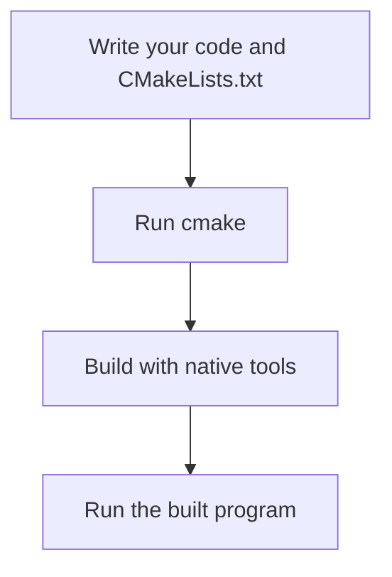

# CMake

**CMake** is a cross-platform code building tool for C and C++ development
- CMake doesn't build the code itself, it generates files for a build system (like Makefiles or Visual Studio project files) to build the code

## Core Workflow

1. Write a `CMakeLists.txt` file in the root of your project
2. Run `cmake` to generate build files
3. Build using other tools (like `make` or Visual Studio)
4. Run the built program

## Build Automation Tools

**make** - default build tool for Unix systems
- `make` reads a `Makefile` to build a project

**nmake** - make alternative for Windows provided as part of Microsoft Visual Studio