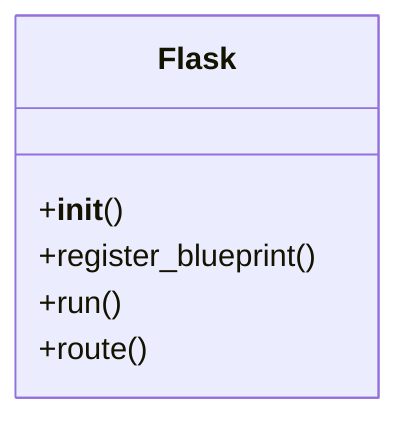

# Flask

Flask is a "ligthweight" Python web framework. It handles routing, request/response handling, and templating. It's good for building REST APIs, small web apps, or microservices with Python including server-side functionality.

Flask is not the best solution if you need to scale up your app for parallel workloads, multi-container deployments, or decoupled long-running processes.

## Background

Flask was preceded by Django
- Django is a "full-stack web framework" for Python
- Django includes a lot and is overkill for simple apps or microservices

## Common Flask Commands

- `flask run` - starts the Flask development server
- `flask shell` - opens a Python shell with Flask context (app, db, etc.)

## Common Flask Tools

Flask
- `app = Flask(__name__)` - creates a new Flask app instance
- `app.route('/path')` - decorator to define a route for the app

Flask Class Diagram



g - an object that provides request-specific data
- `g.user = request.args.get('user', default='guest')` - sets a user in the request context

render_template

request

## Simple File Structure

```bash
my_flask_app/
├── requirements.txt
├── app.py
├── blueprints/
│   └── auth.py
├── templates
│   └── index.html
└── static
    ├── css
    │   └── style.css
    └── js
        └── script.js
```

## Further Research

- [ ] "Pythonic"

- [x] Decorators
- [x] Unpacking
- [x] Variable arguments
- [x] `__name__`